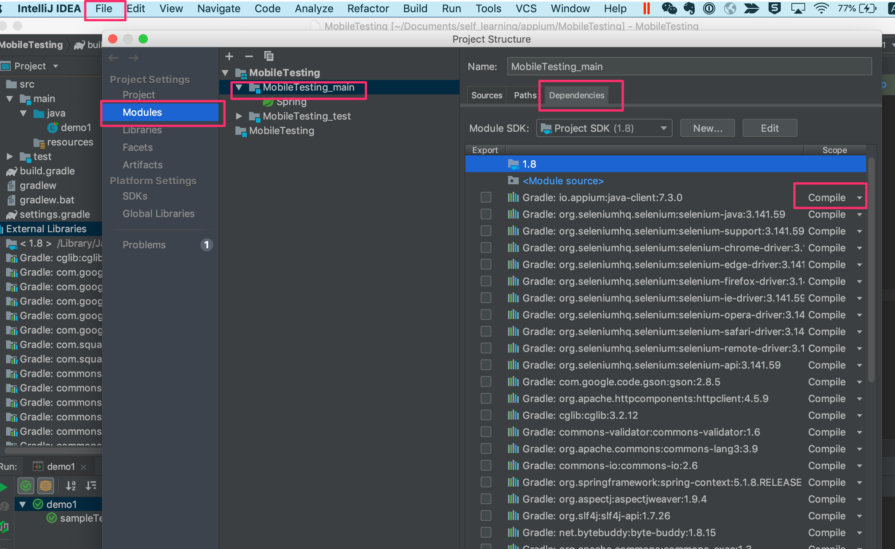

在之前的学习中已经搭好了基于MAC的Appium Desktop平台，在此基础上利用appium来做一个简单的测试例子。由于appium测试的模式是CS模式，client发起请求，server接收到该请求后来操作待测试的app。因此测试实例需要有client，server，app。这里server就是appium desktop，app利用Android studio提供的模拟器中的app，最后client就是我们写的测试代码。
<!--more-->

appium desktop其实本身就包含server和client，因此在用测试代码来测试app之前，先利用appium desktop来完成简单的测试功能。打开appium界面后可以看到右下角有一个start session按钮。其实对于appium来说，启动模拟器并与之进行通信的这个过程叫做session，但是如果直接点击start session按钮，会提示下图的错误信息:  

  

该错误的意思是说在在start session之前需要提供platformName这个参数，由于此次测试用到Android模拟器因此这里可以将platformName设置为android，此时继续点击start session又会提示新的错误信息。按照这样的步骤可以发现对于Android设备，在start session之前需要设置的参数有：
* platformName-表示测试的是什么系统，包括iOS, Android, FirefoxOS
* deviceName-表示使用的移动设备或模拟器的种类，对于iOS设备，必须是有效的手机型号。对于Android设备，该参数虽然必填但是可以输入任意的参数
* appPackage-表示被测试的app的Java包
* appActivity-表示想要启动的app的包  

这里被测试的app是雪球，因此实例需要用到的参数如下图：  

 

再次点击start session可以发现session被成功启动：

 

下面先利用desktop的录制功能来进行实例演练。点击下图所示的“眼睛”即可开始录制，然后选中搜索框元素，点击Tap,接着再次点击搜索框元素，点击Sendkeys，输入alibaba。 

   

此时看模拟器，发现模拟器也停留在搜索alibaba的界面上。

 

在录制的同时也生成了对应的代码，把这部分代码保存下来，利用代码来实现这个测试用例。
 

打开IDEA，新建一个gradle工程，把之前保存下来的代码贴进去，添加appium和selenium依赖。  

 

此时发现代码依然报错，主要是导入的包都不能正确加载。在网上搜索解决方案后，发现解决办法是：打开project structure，点击Modules，点击Dependencies,然后把包加载进来，并把包最右边的选项改为complie。在此之后代码便可以顺利运行。

 

代码为：
```
import io.appium.java_client.MobileElement;
import io.appium.java_client.android.AndroidDriver;
import junit.framework.TestCase;
import org.junit.After;
import org.junit.Before;
import org.junit.Test;
import java.net.MalformedURLException;
import java.net.URL;
import java.util.concurrent.TimeUnit;

import org.openqa.selenium.remote.DesiredCapabilities;

public class demo1 {

    private AndroidDriver driver;

    @Before
    public void setUp() throws MalformedURLException {
        DesiredCapabilities desiredCapabilities = new DesiredCapabilities();
        desiredCapabilities.setCapability("platformName", "android");
        desiredCapabilities.setCapability("deviceName", "test");
        desiredCapabilities.setCapability("appPackage", "com.xueqiu.android");
        desiredCapabilities.setCapability("appActivity", ".view.WelcomeActivityAlias");
        desiredCapabilities.setCapability("autoGrantPermissions", "true");

        URL remoteUrl = new URL("http://localhost:4723/wd/hub");

        driver = new AndroidDriver(remoteUrl, desiredCapabilities);
    }

    @Test
    public void sampleTest() {
        #隐式等待
        driver.manage().timeouts().implicitlyWait(30, TimeUnit.SECONDS);

        #关闭提醒更新的弹窗
        MobileElement temp = (MobileElement) driver.findElementById("com.xueqiu.android:id/image_cancel");
        temp.click();

        MobileElement el1 = (MobileElement) driver.findElementById("com.xueqiu.android:id/tv_search");
        el1.click();
        MobileElement el2 = (MobileElement) driver.findElementById("com.xueqiu.android:id/search_input_text");
        el2.sendKeys("alibaba");
    }

    @After
    public void tearDown() {
        driver.quit();
    }
}
```
至此一个简单的appium测试例子就完成了。在这过程中首先利用appium的录制功能熟悉了如何获取元素，操作元素，并利用录制生成的代码稍加修改后完成了用代码驱动测试的过程。其中由于需要用到app的某些属性，还用到了adb(application debug bridge),这里直接给出了属性，后面会有专门的一篇文章来写相关的东西。
