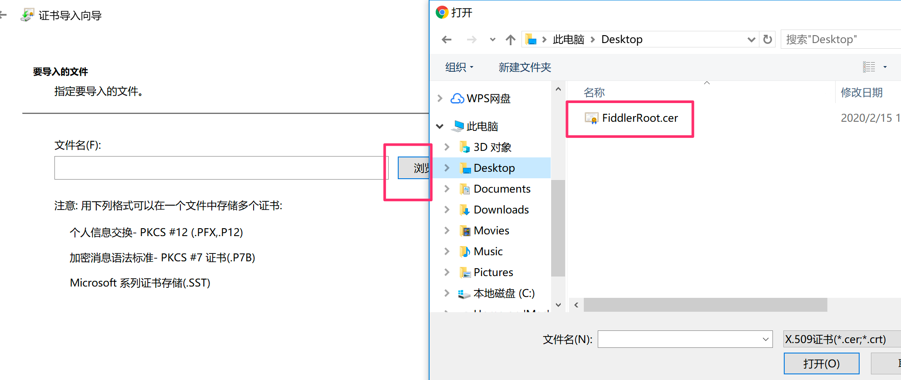
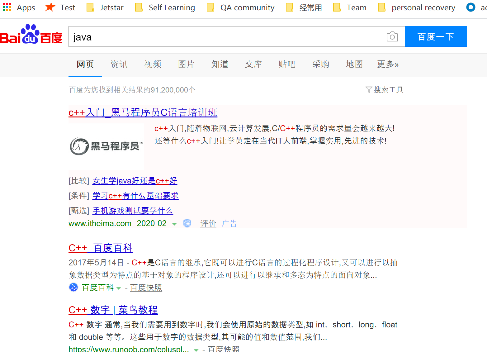

Fiddler是一个常用的抓包软件，Fiddler可以拦截请求，在修改参数后重新提交请求。
<!--more-->
1.官网下载[Fiddler](https://www.telerik.com/fiddler)，并进行安装。  
2.由于Fiddler是默认抓取http请求，因此对于https请求，需要更改Fiddler的设置，并在浏览器上安装证书。操作如下：

* **更改Fiddler设置**  
  打开Fiddler，点击Tools>Options>HTTPS，勾选Decrypt HTTPS traffic。 

  
  

* **导出证书**  
  点击Actions按钮，生成证书并导出证书。  

  
  

* 导入证书
  1)这里使用的是chrome浏览器，打开Settings>Privacy and security,点击Privacy and security  

  

  2)点击导入证书，并选取之前生成的证书，继续下一步直到证书导入成功。
 
 
  
3.Fiddler实践  
1)拦截请求，命令：bpu。例如想要拦截 https://www.baidu.com/， 则
在Fiddler命令行中输入
bpu https://www.baidu.com/， 并按下Enter键,命令行下方会提示已设置好断点。    

&ensp;&ensp;&ensp;  

2)打开chrome浏览器，输入并按下enter键，此时可以发现，网页并不能跳转到百度页面，因为我们设置了对该请求进行拦截，所以此时请求被拦截，网页无法跳转。打开Fiddler，可以看到下图：  

  

如果点击GO,则请求将会释放拦截,网页可以正常跳转。  

   
 
接着搜索Java，网页继续被拦截一直处于loading状态

  

点击找到对应请求，修改参数为C++，并点击run to completation。则搜索结果会变为c++的相关信息。

      

  

  
