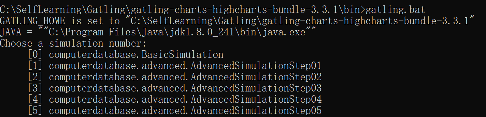
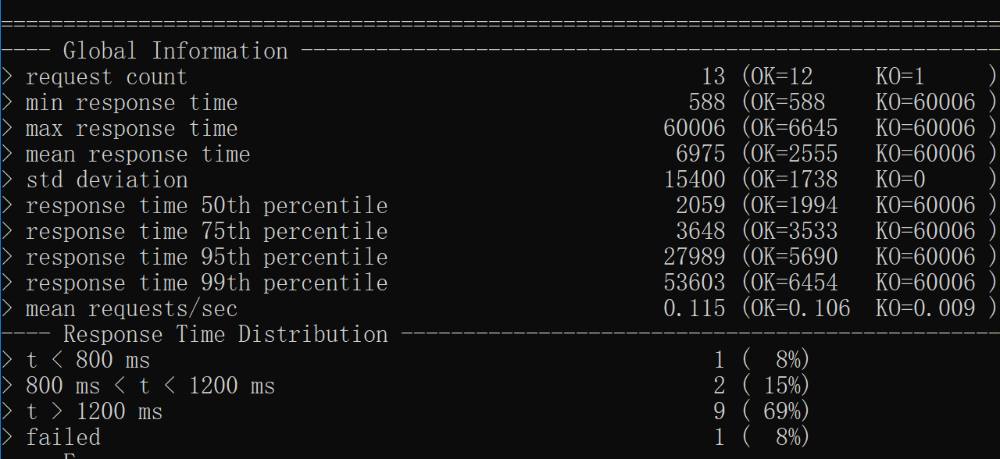

Gatling是一款基于Scala开发的高性能服务器性能测试工具，它主要用于对服务器进行负载等测试，并分析和测量服务器的各种性能指标。Gatling主要用于测量基于HTTP的服务器，比如Web应用程序，RESTful服务等。
<!--more-->
### **获取Gatling**
1.官网下载Gatling
[https://gatling.io/open-source/](gatling)  
2.下载好后解压，会得到如下几个文件夹:  

各个文件夹的作用如下，其中target文件夹会在运行测试后才产生。  

### **使用Gatling进行测试**
1.首先利用自带的脚本来运行测试，从而熟悉整个测试流程。打开命令行窗口并进入Gatling的bin文件夹目录下。  

  

2.执行命令gatling.bat，命令行窗口会显示出所有的测试用例  

3.输入0，连续两次按下Enter键，运行第一个测试用例。  

4.运行一段时间后会得到运行结果  

  

5.在文件夹results里面也会生成详细的运行结果报告。  

