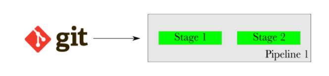
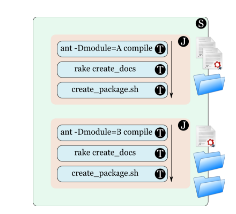

最近开始学习GoCD的知识，首先把其中的一些基础概念弄清楚。以下概念是阅读完官方文档后记录下来的，方便自己随时翻阅。
<!--MOre-->  

**1.Task：**任务或者一个构建任务，是一个需要被执行的操作。通常task是一个命令。例如下图中的命令```
ant -Dmodule=A compile```是一个task。    


**2.Job：**Job通常由多个顺序执行的task组成。如果其中一个task失败了那么这个Job就被视为失败。并且这个Job中剩余的task也不会运行。Job中的每个task都作为独立程序运行，因此，task对其任何环境变量所做的更改都不会影响后续task。task在文件系统上所做的任何更改将对后续task可见。例如下图中，Job包含3个task。  


**3.Stage：**Stage由多个独立执行的Job组成，这意味着GoCD确实是并行执行Stage中的Job。 如果一个Job失败了，那么，包含这个Job的Stage也被认为是失败的。但是因为Job之间是独立运行的，所以其他的Job仍然会继续执行直到结束。例如下图中，Stage包含两个Job且这两个Job是并行的。  


**4.Pipeline：**Pipeline是由多个顺序执行的Stages组成。如果其中一个Stage失败，那么就认为这个Pipeline是失败的。接下来的Stage不会被执行。  


**5.Materials和triggers：**material会触发Pipeline开始执行。通常它是指源代码仓库。GoCD Server持续轮询配置material当发现新的更改或提交时，相应的Pipeline将运行或“触发”。时间触发器是一种特殊的material，它会在特定的时间里面触发Pipeline。Pipeline甚至可以配置多种material，当任一存储库有新的提交时，都会触发Pipeline开始执行。  


**6.Pipeline dependency material：**当有多个Pipeline时，且后执行的Pipeline依赖于先执行Pipeline的执行结果，那么先执行的Pipeline称为上游Pipeline，后执行的Pipeline称为下游Pipeline。例如下图中，Pipeline1是上游Pipeline，Pipeline2是下游Pipeline。


**7.Fan-out和fan-in：**如果一个material的执行结束会触发多个下游Pipeline运行，那么这个material会被视为fan-out.相反如果一个下游Pipeline的触发需要多个上游material，那么这个就被视作fan-in。对于fan-in的Pipeline，GOCD会在上游所有所需material执行完毕后才触发。例如下图中的第一个图，Pipeline3需要Pipeline1和Pipeline2完成后才能被触发，那么这种情况是fan in，且假如Pipeline1和Pipeline2的stage不是同时完成，那么Pipeline3要等到最后一个stage成功完成后才会被触发。  
  
下图中，Pipeline1的完成会触发多个下游的Pipeline运行，所以这种情况会被视为fan-out。  


**8.Artifacts：**Artifacts是指文件或者文件夹。Go中的每个Job可以选择是否发布Artifacts，并且GOCD会让发布的Artifacts对用户和其他下游Stages或者Pipeline可见。  


**9.Agent：**Agent就像是GOCD系统的工人，所有的任务将会在agent上执行。

**10.Resource：**标记agent的标签，标识agent上有哪些资源，用来判断再该agent上是不是可以执行某种任务。

**11.Environments：**GoCD中的Environments是对Pipeline和agent进行分组和隔离的一种方式。
* 一个Pipeline最多与一个Environment相关联
* 一个agent可以与多个Environment相关联，也可不与Environment相关联
* 一个agent只能在与其关联的Environment中拾取属于Pipeline的task。
* 与某个Environment关联的agent不能在与任何环境无关联的Pipeline中执行task。

