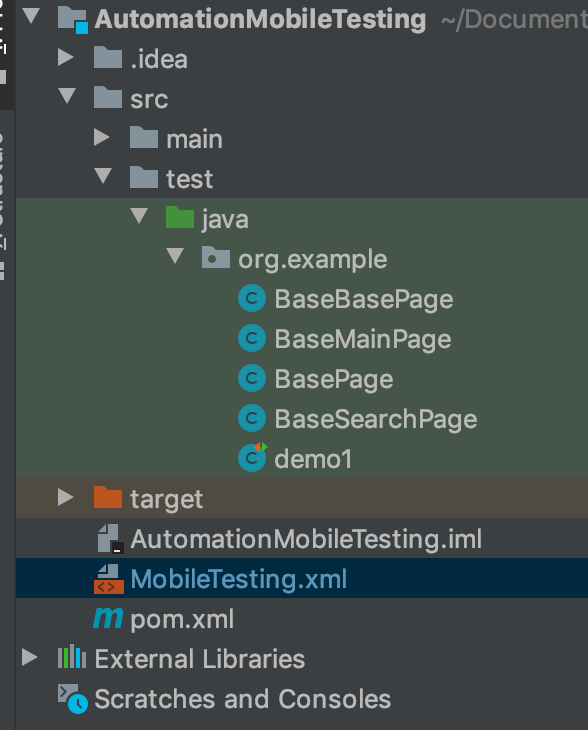
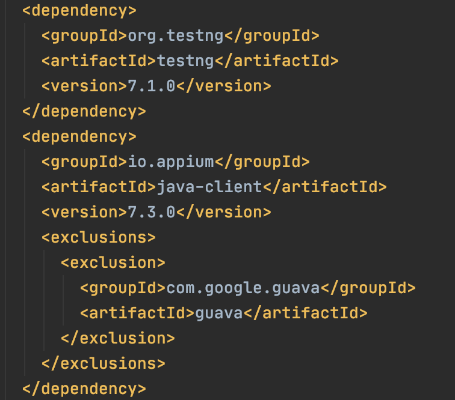
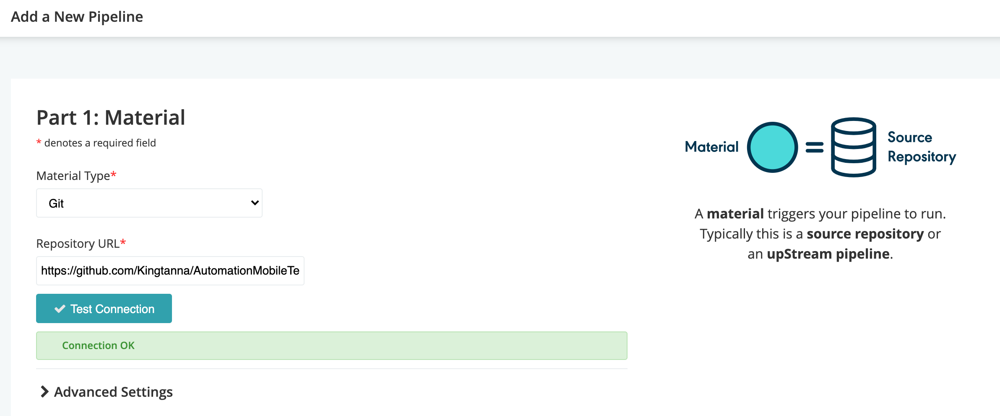
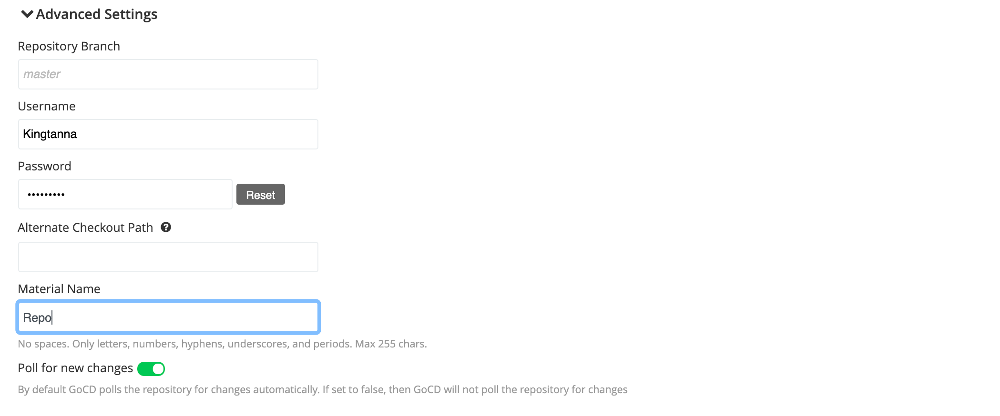
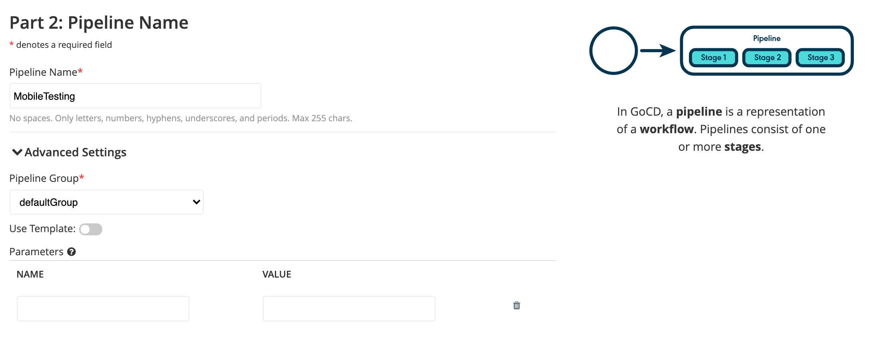
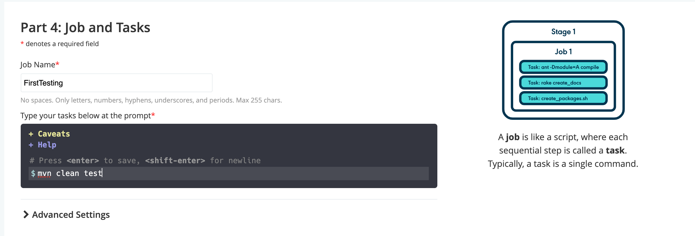
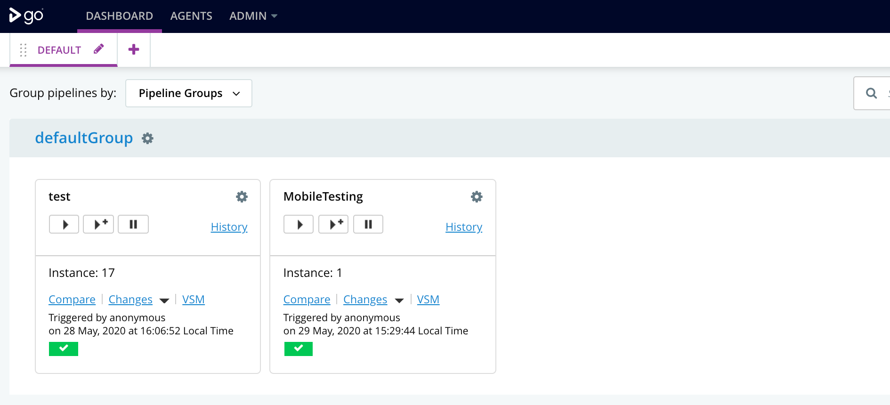
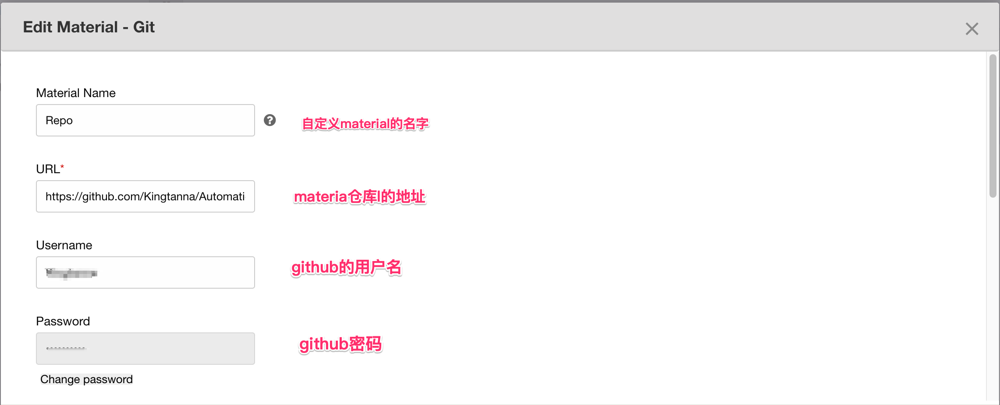
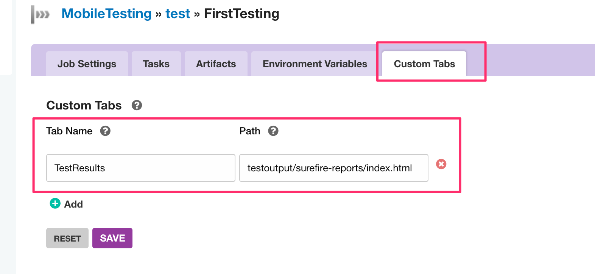

之前学习了TestNG和GoCD的知识，并且已经利用Appium和Java写了简单的基于page object的mobile测试用例。现在将它们联合起来，搭建一个可使用的自动化测试框架。使用到的工具或者框架如下：
<!--More-->
1.Java - 编码语言
2.Appium - mobile测试工具
3.TestNG - 单元测试框架
4.Maven - 项目构建和管理工具
5.GoCD - 持续集成和部署工具

### 一 使用Maven来管理项目
之前在建立测试项目时，使用的是Gradle。由于最近新学习了Maven，所以将其改成Maven项目来巩固Maven的知识。新建一个Maven项目，将之前的代码拷贝进去。  



### 二 添加相关依赖和插件
点击pom.xml文件，然后在工具栏选择code->generate->dependencies，分别添加testng依赖、appium client依赖，还有surefire插件。之所以添加这个插件是因为maven本身不执行测试，需要这个插件来执行测试。添加以后这些依赖会自动添加到pom.xml文件中，但是需要手动点击这些依赖右上方的 ```m``` 来真正下载这些依赖。  
   





### 三 添加xml文件
由于使用TestNG时需要使用testng.xml文件来运行测试用例，而在建立项目时该文件不会自动生成，因此需要手动去创建该文件，并且添加相应的配置代码。

<?xml version="1.0" encoding="UTF-8"?>
<!DOCTYPE suite SYSTEM "http://testng.org/testng-1.0.dtd">
<suite name="Default Suite">
    <test name="Demo">
        <classes>
            <class name="org.example.demo1">
                <methods>

                </methods>
            </class>

        </classes>
    </test>
</suite>
  


### 四 push测试代码到GitHub仓库
在上述三个步骤做完后，测试代码可以顺利运行。在此基础之上，将本地代码push到远程的GitHub仓库。具体操作步骤，这里不再赘述。

### 五 实现持续集成和部署
1.打开terminal，分别进入到GoCD server和agent目录下，启动server和agent。
2.打开浏览器，输入http://localhost:8153/go/pipelines#!/ ， 进入到GoCD页面。该页面就会提醒新建一个pipeline。下面就按照提示一步步来操作。  
* **增加material，这里我放的是之前测试代码的仓库地址。可以点击绿色的按钮，测试连接是否成功。**
   

 

* **添加Pipeline**
   

* **添加Stage**
     

* **添加Job和Task**
   

* **生成Pipeline**
   
 
经过以上步骤后就生成了一个最简单的pipeline，接下来可以根据需要来设置pipeline的参数，例如运行时间，运行命令和显示测试报告等。


### 六 设置Pipeline
**1.设置Pipeline的material地址。**在前面我们新建Pipeline的时候添加过material，现在再次进入material设置界面确认一下是否添加正确，若没有再补上即可。其中有一项是Destination directory，它的作用是新建一个对应名字的文件夹，在pipeline运行时，将下载下来的代码存放在该文件夹下。这个路径是一个相对路径，位置为GoCD文件夹/go-agent文件夹/pipelines/Destination directory文件夹。例如我填的是AutoMobileTetsing,那么我的代码存放路径为：GOCD/go-agent-20.3.0/pipelines/AutoMobileTetsing。



**2.添加task。**一个task通常就是一条命令，这里我们加上```mvn test```这个命令来运行测试代码。在下图**1**处输入mvn时即会出现相关的命令，然后选择测试命令，左边**2**区域里就会自动填上选择的命令。最后填上Working Directory，这个路径指的是命令生效的路径，那么这里填的就是之前代码下载下来的路径。同样的，这也是一个相对路径。


**3.添加artifacts。**每个Job都可以产生artifacts，通过artifacts可以知道代码运行的情况。对于测试而言，最终是需要产生测试报告来评估测试的结果。这里通过添加artifacts来展示测试结果。
* 设置artifacts，如下图所示，Source中填agent上surefire reports的地址，其路径为：GoCD文件夹/go-agent文件夹/pipelines/material地址/代码仓库/target/surefire-reports。Destination上填在server上surefire reports的存放地址，这个地址是在GoCD文件夹/go-agent文件夹/artifacts/pipelines/下。这两个地址的路径都属于相对路径。
   

* 添加tap。为了方便的显示测试结果，可以增加一个tap，后面只要点击tap就可以看到测试结果。下图的路径就是上一步中我们填的server上report的地址
 
 上述两个步骤做完后，就可以看到运行结果。


经过上述步骤后就搭建起来了一个简单的mobile自动化测试框架，后续在此基础再添加新的pipeline，新的设置，或者新的测试代码。在搭建过程中可能会遇到一些问题，可以通过console打印出的error找出问题所在。
