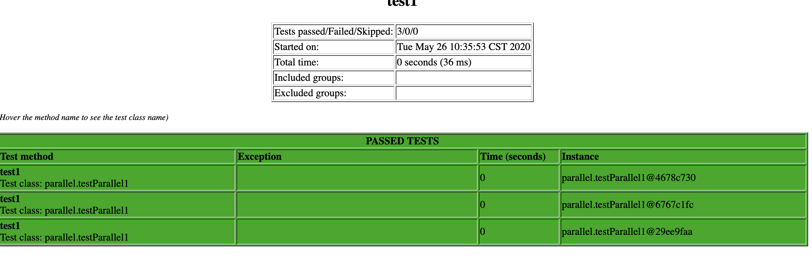

#### &lt;suite&gt;级别的并发
TestNG在&lt;suite&gt;级别的并发主要由parallel参数来决定，且该参数要和thread-count配合使用，否则没有意义。
一共有如下四种不同的并发:
<!--more-->


<suite name="Testng Parallel Test" parallel="methods" thread-count="5">
<suite name="Testng Parallel Test" parallel="tests" thread-count="5">
<suite name="Testng Parallel Test" parallel="classes" thread-count="5">
<suite name="Testng Parallel Test" parallel="instances" thread-count="5">


**1.methods级别的并发**，TestNG将在单独的线程中运行所有测试方法
举个例子:

public class testXml {
    @Test
    public void test1()
    {
        System.out.println("testXml的test1运行" + " "+ "Current Thread Id: " + Thread.currentThread().getId());
    }

    @Test
    public void test2()
    {
        System.out.println("testXml的test2运行" + " "+ "Current Thread Id: " + Thread.currentThread().getId());
    }

testNG.xml文件设置如下:

<suite name="testXml" parallel="methods" thread-count="5">


测试结果为：

testXml的test1运行 Current Thread Id: 11
testXml的test2运行 Current Thread Id: 12


**2.tests级别的并发**，相同test tag下的测试case将会在同一个进程中运行，不同test tag 下的测试case会在不同的进程中运行。  
举个例子:
test1和test2仍然在同一份test tag下，将并发参数改为：

<suite name="Testng Parallel Test" parallel="tests" thread-count="5">


运行结果为：

testXml的test1运行 Current Thread Id: 11
testXml的test2运行 Current Thread Id: 11


再将test1和test2分别放在不同的test tag下：

<suite name="testXml" parallel="tests" thread-count="5"  >
    <test name="test1">
        <classes>
            <class name="org.example.testXml">
                <methods>
                    <include name="test1"/>
                </methods>
            </class>
        </classes>
    </test>

    <test name="test2">
    <classes>
        <class name="org.example.testXml">
            <methods>
                <include name="test2"/>
            </methods>
        </class>
    </classes>
    </test>
</suite>

运行结果为：

testXml的test2运行 Current Thread Id: 12
testXml的test1运行 Current Thread Id: 11


**3.class级别的并发**，不同class tag下的用例可以在不同的线程执行，相同class tag下的用例只能在同一个线程中执行
举个例子：
引入testXml2的测试case，testNG.xml的文件变成：

<suite name="testXml" parallel="classes" thread-count="5"  >
    <test name="test1">
        <classes>
            <class name="org.example.testXml">
            </class>
            <class name="org.example.testXml2">
            </class>
        </classes>
    </test>

运行结果为：

testXml的test1运行 Current Thread Id: 11
testXml2的test1运行 Current Thread Id: 12
testXml2的test2运行 Current Thread Id: 12
testXml的test2运行 Current Thread Id: 11


**4.instance级别的并发**，同一个实例的方法将会在同一个线程中运行，不同实例的方法将会在不同线程中运行。
举个例子：

public class testParallel1 {
    public int i;
    public testParallel1(int i) {this.i = i;}

    @Test
    public void test1()
    {
        System.out.println("testXml的test1运行" + " "+ "Current Thread Id: " + Thread.currentThread().getId() + "第"+i);
    }

    @Factory
    public static Object[] create()
    {
        List<testParallel1> list = new ArrayList<testParallel1>();
        list.add(new testParallel1(1));
        list.add(new testParallel1(2));
        list.add(new testParallel1(3));
        return list.toArray();
    }

从上面代码可以看到，一个测试用例，三个参数，共三个用例，每个用例都是一个实例。所以应该有三个并发。
如果是没有@Factory注解的普通用例，则没效果。
运行结果为：


testXml的test1运行 Current Thread Id: 13第2
testXml的test1运行 Current Thread Id: 12第1
testXml的test1运行 Current Thread Id: 11第3

可以看到，在这种并发模式下每个不同的实例都会在不同的线程中运行。  

#### 用例级别的并发

public class testParallel1 {
    //线程数为3，调用次数为6，超时时间为1000ms
    @Test(threadPoolSize = 3 , invocationCount = 6 , timeOut = 1000)
    public void test1()
    {
        System.out.println("testXml的test1运行" + " "+ "Current Thread Id: " + Thread.currentThread().getId());
    }
}

运行结果为：

testXml的test1运行 Current Thread Id: 16
testXml的test1运行 Current Thread Id: 15
testXml的test1运行 Current Thread Id: 14
testXml的test1运行 Current Thread Id: 15
testXml的test1运行 Current Thread Id: 16
testXml的test1运行 Current Thread Id: 14

在这个例子里面，通过invocationCount设置test1方法的调用次数，通过threadPoolSize设置启用的线程数。从结果看到，test1被调用6次，总共在3个线程里面运行，和设置的参数一致。