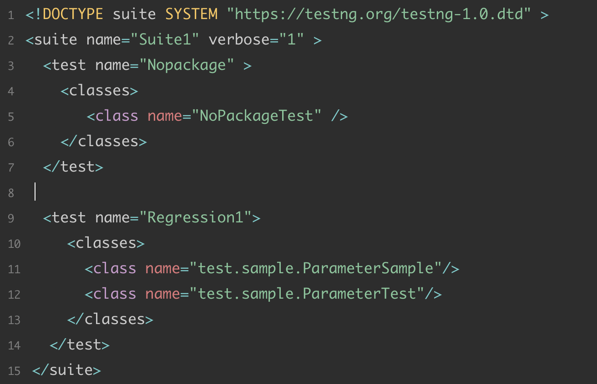

学习TestNG框架时，不得不提到TestNG的xml文件，利用xml文件可以按照我们需要的配置来运行测试用例。
<!--more-->
xml文件的内容如下：
 
从图中可以看到，xml文件主要包含三大部分:&lt;suite&gt;，&lt;test&gt;，&lt;parameter&gt;。一个典型的xml文件的格式如下图所示。 
 

**1.&lt;suite&gt;**  

&lt;suite&gt;是testng.xml文档中最上层的元素，一个xml文件只能有一个<suite>，它是一个xml文件的根级。&lt;suite&gt;下可包含&lt;parameter&gt;元素
以及多个&lt;test&gt;标签。&lt;suite&gt;标签下有很多参数，每个参数的作用如下表所示:  
  
|参数|说明|使用方法|参数值|
|-|-|-|-|
|name|必选项，&lt;suite&gt;的名字，将出现在reports里|name="XXX"|suite名字|
junit|	是否执行Junit模式(识别setup()等)	|junit="true"	|true和false，默认false
verbose	|控制台输出的详细内容等级,0-10级（0无，10最详细）|	verbose="5"	|0到10
parallel|	是否在不同的线程并行进行测试，要与thread-count配套使用	|parallel="mehods"	|详见表格下内容，默认false
parent-module|	和Guice框架有关，只运行一次，创建一个parent injector给所有guice injectors	
guice-stage	|和Guice框架有关|	guice-stage="DEVELOPMENT"	|DEVELOPMENT，PRODUCTION，TOOL，默认"DEVELOPMENT"
configfailurepolicy	|测试失败后是再次执行还是跳过，值skip和continue|	configfailurepolicy="skip"|	skip、continue，默认skip|
thread-count|	与parallel配套使用，线程池的大小，决定并行线程数量|	thread-count="10"	|整数，默认5|
annotations	|获取注解，值为javadoc时，使用JavaDoc的注释；否则用JDK5注释|	annotations="javadoc"	|javadoc|
time-out|	设置parallel时，终止执行单元之前的等待时间（毫秒）	|time-out="10000"	|整数，单位毫秒|
skipfailedinvocationcounts|	是否跳过失败的调用	|skipfailedinvocationcounts="true" | true和false，默认false
data-provider-thread-count|	并发时data-provider的线程池数量	|data-provider-thread-count="5"	|整数
object-factory|	一个实现IObjectFactory接口的类，实例化测试对象	|object-factory="classname"	|类名
allow-return-values|是否允许返回函数值	|all-return-values="true"|	true和false
preserve-order|	是否按照排序执行|	preserve-order="true"	|true和false，默认true
group-by-instances|	按照实例分组	|group-by-instances="true"	|true和false，默认false

**2.&lt;test&gt;**  
一个&lt;suite&gt;下可以有多个&lt;test&gt;,&lt;test&gt;由&lt;parameters&gt;、&lt;groups&gt;、&lt;classes&gt;三部分组成,每个部分的作用如下：  
* &lt;parameter&gt; ： 提供测试数据，有name和value两个参数  
声明方法：&lt;parameter name = "parameter_name" value = "parameter_value "/&gt;
testng.xml文件中的&lt;parameter&gt;可以声明在&lt;suite&gt;或者&lt;test&gt;级别，在&lt;test&gt;下的&lt;parameter&gt;会覆盖在&lt;suite&gt;下声明的同名变量。  

* &lt;groups&gt;：要运行的组，可以自定义一个组，可以包括要执行的，和排除要执行的方法。必须和<classes>配套使用，从下面的类中找到对应名字的方法。  

* &lt;classes&gt;：方法选择器，要执行的方法写在这里，参数有name和priority，
&lt;classes&gt;下必须写要执行的&lt;class】&gt;，否则不会执行任何内容，如果填写了class没有写methods，会按照填写的class的下的注释@Test去执行所有的方法。

&lt;test&gt;标签下也有很多参数，参数用法如下:  

参数 |	说明 |	使用方法 |	参数值 |  
:-|:-|:-|:-|
name|	test的名字，将出现在报告里|	name="testname"	|test的名字
junit|	是否按照Junit模式运行	|junit="true"	|true和false，默认false
verbose|	控制台输出的详细内容等级,0-10级（0无，10最详细），不在报告显示|	verbose="5"	|0到10
parallel|	是否在不同的线程并行进行测试，要与thread-count配套使用|	parallel="mehods"	|与suite的parallel一致，默认false
thread-count|	与parallel配套使用，线程池的大小，决定并行线程数量|	thread-count="10"|	整数，默认5
annotations	|获取注解，值为javadoc时，使用JavaDoc的注释；否则用JDK5注释	|annotations="javadoc"	|javadoc
time-out	|设置parallel时，终止执行单元之前的等待时间（毫秒）|time-out="10000"	|整数，单位毫秒
enabled|	标记是否执行这个test|	enabled="true"|	true和false，默认true
skipfailedinvocationcounts	|是否跳过失败的调用	|skipfailedinvocationcounts="true"|	true和false，默认false
preserve-order	|是否按照排序执行，如果是true，将按照xml文件中的顺序去执行|	preserve-order="true"|	true和false，默认true
allow-return-values	|是否允许返回函数值	|all-return-values="true"	|true和false，默认false  

**2.1&lt;group&gt;标签**  
&lt;groups&gt;由&lt;difine&gt;和&lt;run&gt;、&lt;dependencies&gt;三部分组成。&lt;diffine&gt;可以将group组成一个新组，包括要执行和不执行的大组；&lt;run&gt;要执行的方法；&lt;dependencies&gt;指定了某group需要依赖的group.  


<groups>
       <define name ="all">
            <include name ="testgroup1"/>
            <exclude name ="testgroup2'/>
       </define>
       <run>
            <include name ="all"/>
            <include name ="testmethod1"/>
            <exclude name="testmethod2"/>
      </run>
      <dependencies>
           <group name ="group1" depends-on="group2 group3"/>
      </dependencies>
 </groups>  
   

