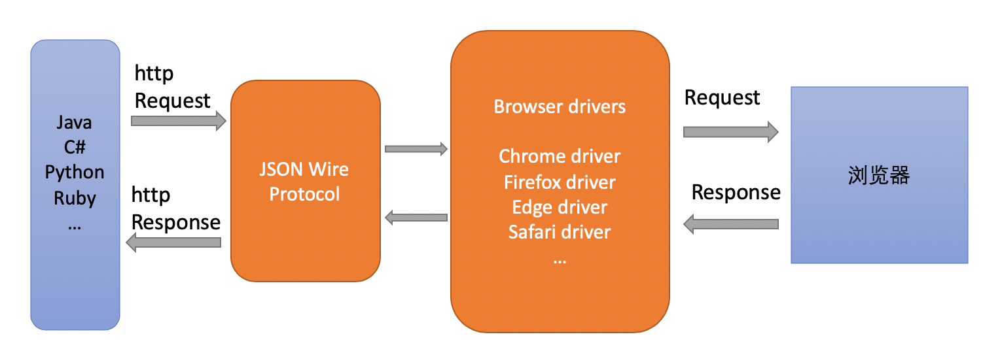

工作以来一直在使用selenium或者说是webdriver进行web UI的测试，基本流程为首先了解需求从而构建测试用例，然后就开始写测试代码，例如给元素定位，写调用函数等。直到昨天，我问自己webdriver究竟是如何来做测试的，或者说它的运行原理是什么。我这才意识到，我每日都在使用的工具，但实际上我并没有真正懂得它的工作原理。所谓知其然但不知其所以然大概就是这种现象吧。心中顿感羞愧，于是赶紧恶补了webdriver的相关底层知识。
<!--More-->

在网上看了十几篇相关的介绍后，有一个例子给我留下了深刻的印象，这里我依然想引用这个例子来加强印象和理解。大家都有坐出租车的经验，这个过程一般为：
```
乘客告诉司机目的地地址
司机操作出租车，例如直行1.3公里，先右拐，再左拐等等
出租车按照指令行驶，最终到达目的地
```
在上述这个例子中，乘客为请求发出者，司机为请求解析者，出租车为最终请求执行者。类比到使用webdriver做测试的过程：
```
乘客告诉司机目的地地址  --> 测试代码发出测试请求，其中包括对浏览器的各项操作
司机操作出租车，例如直行1.3公里，先右拐，再左拐等等  --> 浏览器驱动接受并解析请求，将解析的结果发给浏览器
出租车按照指令行驶，最终到达目的地  -->  浏览器执行请求中的各项操作
```
对应成图来理解就是：
  

问题来了，假如出租车司机遇到了外国乘客，他很有可能听不懂外国乘客的语言，这样出租车司机就有可能无法完成这一单生意。同样的，不同的项目可能使用不同的语言，那么在写测试用例的时候，webdriver又怎么保证每个语言它都能解析呢？
为了回答上述问题首先来看看请求是什么？向浏览器发送请求是基于http协议，这个协议规定了每一个请求的格式，包括http请求头，请求内容，也就是说不论是什么语言，所发出的http请求的格式是一致的。而webdriver是基于JSON Wire Protocol这个协议，该协议会将所有的请求统一处理为json的格式，也就是说编写测试代码的语言也许不一致，但是当测试代码的请求到达webdriver的时候这些请求就被处理成了统一的格式。因此使用webdriver时就与语言解耦了，这个过程可以用下面的图来解释。
  

以上就是webdriver的基本工作原理，通过这次对webdriver原理的追根溯源，我意识到学习知识一定要多问几个为什么。有时候总会以为自己懂了，但实际上根本不懂，又或者所学到的知识都是散落的点，无法从点到面，形成一个系统化的知识框架。
