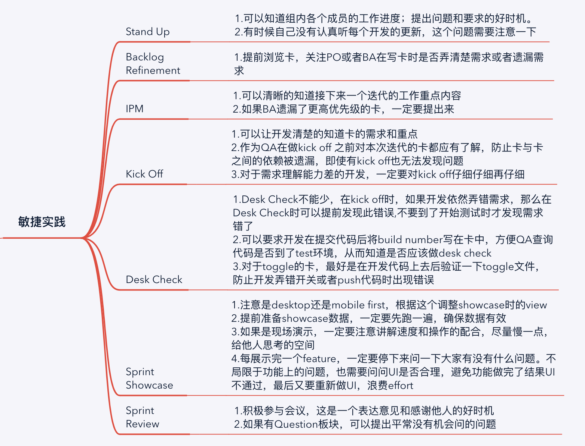

再有三个月我就加入公司两年了，时间过的真的非常快。自从加入公司后我便一直在这个项目上，时间长了，有一种自己就是工作于当前项目公司的员工，所以第一次听到项目要结束时便产生了一些失落感，仿佛不久之后自己也要失业了。但由于项目很大，所以真正结束也需要很长的一段时间。然而谁也没有想到这次席卷全球的“黑天鹅”事件竟然匆匆忙忙就结束了项目，真的是人算不如天算。一年七个月有很多收获，我想把他们记录下来，不论是做的好的地方还是做的不好的地方，希望给以后的自己留下一些积累。
<!--more-->

### 敏捷实践  

   
 真正上了项目以后才知道敏捷实践是怎么做的，以及它们在我们日常工作中的重要性。上图记录了我的日常工作，以及收获和反思。
 
### 测试技能  
  
测试这一块包含的东西特别多，图中基本涵盖了大部分的工作，但是没有特别多的细节。对于FT，项目主要采用了selenium+web driver的框架来开展测试。而代码则是基于page object的模式来编写。之前我只知道这样子去编写代码，但是没有深入了解这种编码模式的好处。直到前一段时间，自己利用page object模式编写了简单代码后才真正了解了这种编码形式的好处。这一块的内容仍然需要继续深入学习。

### 客户影响力  
在团队内部我觉得自己算是很活跃的一份子，但依然会觉得对于客户的影响力不够。我也思考过其中的原因：
1.自身能力不够强，缺乏足够的说服力
2.上项目时间仍然很短，虽然我是小组的QA，但是因为有时间更长的tribe QA在，所以会在我的基础上参考tribe QA的观点
关于客户影响力，我始终觉得这是一个不好量化的能力，什么样是客户影响力高？大多数观点都被采纳就是影响力高么？在项目匆忙结束下我竟然忘了向团队成员们要feedback,这个点确实是有点失误。也许要了feedback我能知道一下答案吧。这个问题只能留给以后的我去解答了。

### 同事相处
感觉自己是很幸运的，因为团队的人都非常nice，即使他们中有的都已经工作了十年+，但是对于我这个一毕业就加入他们的小白没有任何看轻的意思。非常感谢他们，我在工作以后仍然有和同学相处的感觉，不必为了同事之间的关系而烦恼。不知道以后会遇到什么样的同事，希望能够友好相处。 

现在正处于等待项目的空闲期，可以好好充实自己为下一个项目做好准备。继续加油啦~

